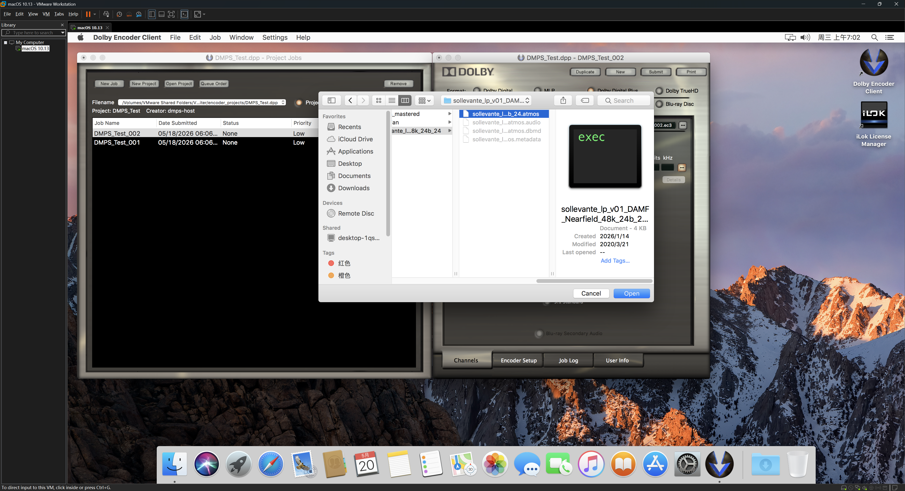
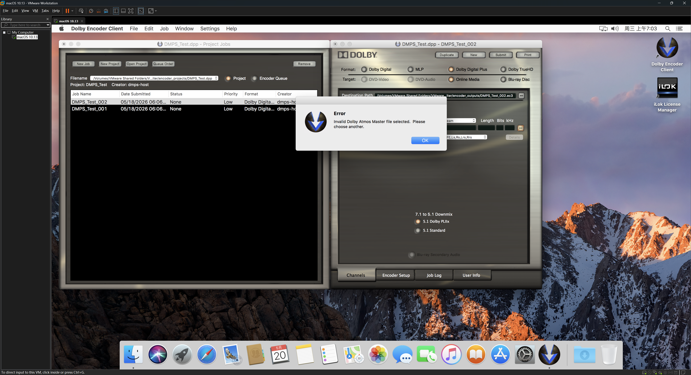
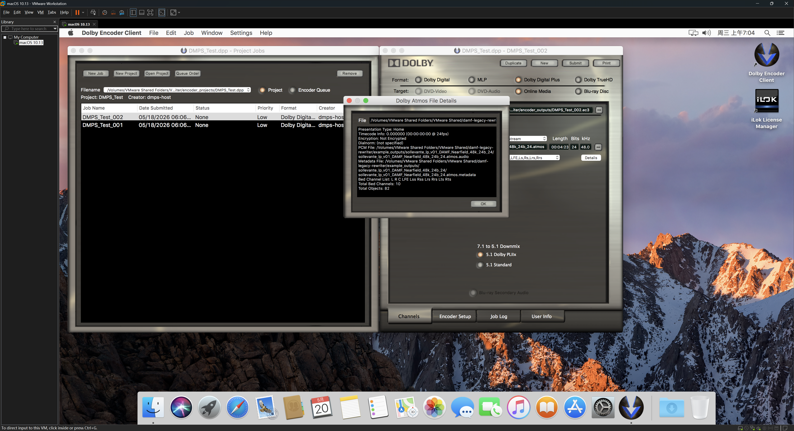
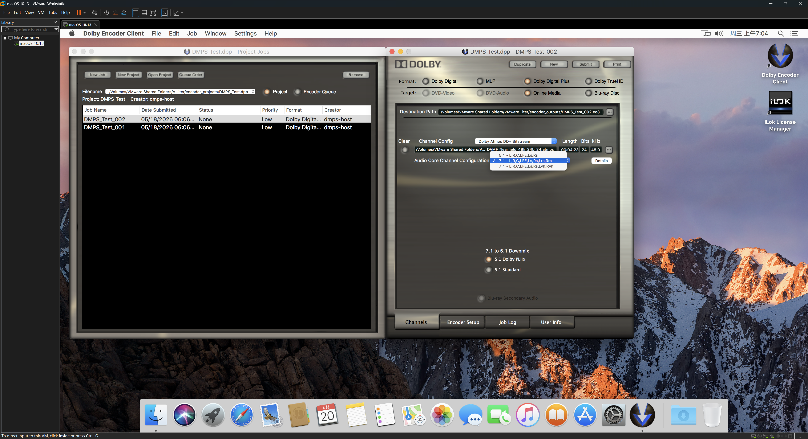
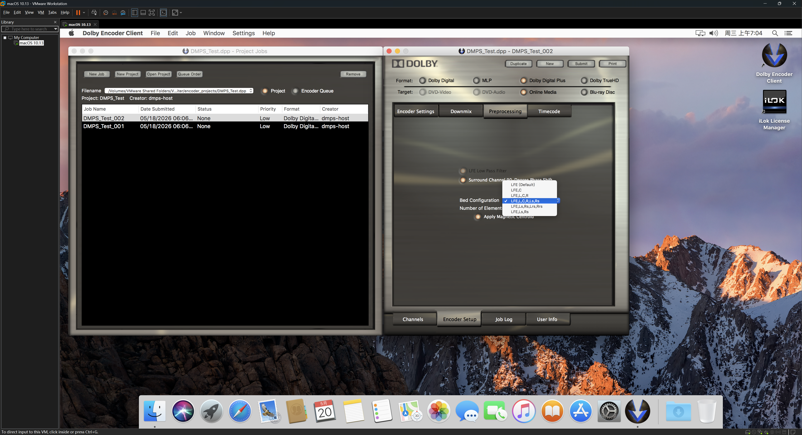
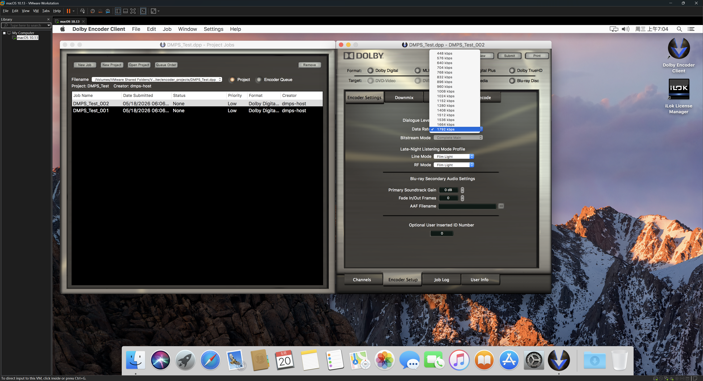

# DAMF Legacy Rewriter

This project rewrites a modern Dolby Atmos Master File set into the older flat DAMF profile that has been empirically accepted by Dolby Media Producer Suite (DMPS) v2.0 build `2976134`.

The final minimal project is intentionally only these files:

- `convert_damf_to_dmp20.py`
- `README.md`
- `INTERACTION_SIMULATION.md`
- `KEY_PROMPTS.md`
- `demo_screenshots/`

All probes, generated DAMFs, archived experiments, static-analysis helpers, and sample media are intentionally excluded from the final working tree. The demo screenshots are retained only as import-behavior evidence.

## Demo Screenshots

These screenshots show manual Dolby Media Producer Suite v2.0 import behavior for an original modern DAMF v0.5.1 input and for the rewritten DAMF v0.3 output.

### Original DAMF v0.5.1 Import Failure





### Rewritten DAMF v0.3 Import









## Scope

The converter targets DMPS v2.0 import compatibility. It does not prove Dolby Digital Plus with Dolby Atmos encoding success. Encoding behavior still needs validation on a licensed DMPS v2.0 installation.

The current profile is based on manual import tests against DMPS v2.0 and modern DAMF v0.5.0/v0.5.1 inputs.

## Requirements

- Python 3
- `numpy`
- `PyYAML`

Input files must be a matching DAMF triplet:

- `<name>.atmos`
- `<name>.atmos.audio`
- `<name>.atmos.metadata`

The input CAF must be 24-bit little-endian LPCM. The converter rewrites the CAF only when the output requires channel merging, channel dropping, channel reordering, or a CAF header change. When the required output channel order is byte-for-byte identical to the source CAF channel order, the converter reuses the source CAF through a hard link and falls back to copying if linking is unavailable.

## Usage

```powershell
python convert_damf_to_dmp20.py --source-dir .\input --dest-dir .\output --name movie
```

By default, metadata output omits `size3D`. Pass `--emit-size3d` to write `size3D`
using the same legacy compatibility mapping.

The command reads:

```text
.\input\movie.atmos
.\input\movie.atmos.audio
.\input\movie.atmos.metadata
```

and writes:

```text
.\output\movie.atmos
.\output\movie.atmos.audio
.\output\movie.atmos.metadata
```

There is no skip-audio mode. The converter always validates the CAF, then either reuses it when the mapping is identical or rewrites it when the mapping changes.

## Supported Input Beds

The source `.atmos` may contain one or more bed instances using these layouts:

- 2.0: `L R`
- 5.1 side: `L R C LFE Lss Rss`
- 5.1 back: `L R C LFE Lrs Rrs`
- 7.1: `L R C LFE Lss Rss Lrs Rrs`
- 7.1.2: `L R C LFE Lss Rss Lrs Rrs Lts Rts`

Supported aliases:

```text
Ls  -> Lss
Rs  -> Rss
Lb  -> Lrs
Rb  -> Rrs
Ltm -> Lts
Rtm -> Rts
```

Any other bed label set is rejected. There is no 9.1 special handling and no static-object fallback for unsupported bed channels.

## Source ID Rules

Modern DAMF tools reserve 10 source IDs per input bed. The converter enforces that model.

Within each bed block, channel IDs must use canonical 7.1.2 slot positions:

```text
L=0, R=1, C=2, LFE=3, Lss=4, Rss=5, Lrs=6, Rrs=7, Lts=8, Rts=9
```

For bed index `N`, add `10 * N`.

Examples:

- First 5.1 side bed: `0,1,2,3,4,5`
- First 5.1 back bed: `0,1,2,3,6,7`
- First stereo bed: `0,1`
- Second 5.1 back bed: `10,11,12,13,16,17`

Source object IDs must be greater than or equal to `10 * bed_count`. Source object IDs may be sparse, but all source channel/object IDs must be unique.

CAF audio is still packed in the actual channel order listed by the source bed and object lists. It does not contain silent placeholder tracks for unused ID slots.

## Output `.atmos`

Top-level fields:

```yaml
version: 0.3
```

Presentation fields:

- `type`: fixed `home`
- `simplified`: fixed `false`
- `metadata`: output metadata filename
- `audio`: output audio filename
- `offset`: preserved from input
- `ffoa`, `surroundTrim_7_1`, `surroundTrim_5_1`, `fps`: preserved only if present in input
- `scBedConfiguration`, `scNumberOfElements`, `roomWidth`, `roomLength`, `roomHeight`, `screenSizeRatio`: preserved only if present in input
- `dialnorm`/`dialNorm`: preserved only if present in input and emitted as `dialnorm`
- `creationTool`: fixed `DAMF Legacy Rewriter for DMPS v2.0 by LumaVista`
- `creationToolVersion`: fixed `Only Tested DAMF v0.5.0 & v0.5.1 to v0.3`

Discarded presentation fields include `salt`, `audioCipherIV`, and `metadataCipherIV`.

Output channel entries are regenerated:

- Bed channels are named `BED <label>` and use `bed: <label>`.
- Object channels are named `OBJ 1`, `OBJ 2`, and so on.
- `.atmos` uses `ID`, not `objectID`.
- Bed channel IDs are compact and zero-based in output bed order.
- Object channel IDs always start at `10` and increase contiguously, independent of the number of output bed channels.

## Output `.atmos.metadata`

Top-level fields:

```yaml
sampleRate: 48000
```

Only source object events are retained. Bed events are filtered out.

When an output event ID is emitted, the field is `objectID`. It starts from zero in object namespace only, independent of global `.atmos` channel IDs. Source events that omit `ID` or `objectID` keep that omission in the output.

Event fields are emitted in this order when applicable:

```text
objectID, samplePos, active, pos, snap, elevation, zones,
size, size3D, decorr, importance, gain, rampLength,
dialog, music, screenFactor, depthFactor
```

`size3D` is included in that position only when `--emit-size3d` is passed.

Rules:

- Event fields may be omitted.
- Source events without `ID` or `objectID` inherit the most recent explicit source event ID only for filtering and object mapping. They are retained when that inherited ID maps to a source object, filtered when it maps to a bed/non-object ID, and written without `objectID`.
- Normal event fields are emitted only when the source event contains them.
- Boolean fields `active`, `snap`, `elevation`, `size3D`, and `decorr` are normalized to `false` or `true`.
- `size` is emitted if present.
- `size3D` is normalized/calculated with the same legacy compatibility rules, but is not emitted by default.
- With `--emit-size3d`, if `size` exists and `size3D` exists, emit normalized `size3D`.
- With `--emit-size3d`, if `size` exists and `size3D` is absent, write `size3D: true`.
- If `size` is absent, do not write `size3D`, even with `--emit-size3d`.
- `decorr` is emitted only when both `size` and `decorr` exist.
- `dialog`, `music`, and `importance` are preserved when present.
- If there are no object events, the output is `events: []`.

## Audio Mapping

Output CAF channel order is:

```text
output bed channels, then output objects
```

Multiple input beds that contribute the same output label are summed directly. The producer must ensure the source does not overload. The converter raises an error if mixed samples exceed 24-bit integer range.

If the selected output order exactly matches the source CAF order, the converter reuses the input CAF instead of rewriting audio samples. Reuse is allowed only when there is no merge, drop, reorder, or channel-count/header change.

## Verification Status

Manual DMPS v2.0 import testing has accepted representative converted files for:

- stereo bed
- 5.1 side bed
- 5.1 back bed
- 7.1 bed
- direct 7.1.2 bed
- bed-only cases with `events: []`

Known remaining risks are tracked in `KEY_PROMPTS.md`.
